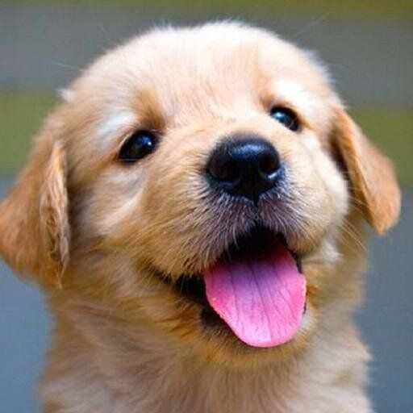
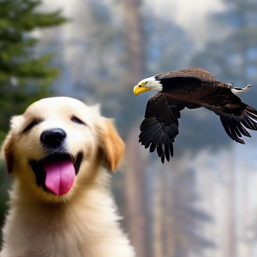

# open-griffin

A reimplementation of Griffin (Mikaeili et al., 2025), a training-free method for composing several
reference images into one picture under a layout you specify.

You give it one reference image per subject and a box or mask saying where each subject goes. It
inverts each reference, caches the self-attention keys and values from that inversion, and splices
them back into the target's self-attention during generation. No training, no per-subject
optimization.

## Example

Nothing was trained or fine-tuned between these images.

### Before

| `data/references/dog.png` | `data/references/eagle.png` |
| :---: | :---: |
|  |  |

### After



Prompt: *a dog and a bald eagle with a white head in a sunlit forest clearing, highly detailed*, with
the dog boxed into the lower left and the eagle into the upper right. Run with
[examples/dog_eagle.json](examples/dog_eagle.json) at `--seed 0`.

The puppy's face and the eagle's plumage both survive the composition, and each one lands in the
region it was assigned. Both subjects come out smaller than their boxes allow, which is the clearest
remaining gap between this and the paper's figures.

## Status

All three stages are implemented and it runs end to end on SD 1.5. Identity transfer works, SAM
refines a rectangular box into a real silhouette, and subjects land mostly inside the regions they
were given (91% and 83% of mask area inside their boxes on the example spec).

Subjects still render smaller than their boxes allow, so the composition sits at roughly 65%
background. The hyperparameters are the paper's, untuned.

## Install

```bash
make setup-env       # uv venv on python 3.11
source .venv/bin/activate
make install         # torch + cu130, then requirements.txt
make test            # 16 checks, no GPU or weights needed
```

## Run

Write a spec file naming the target prompt and each subject. Boxes are normalized `x0,y0,x1,y1`. Use
`"mask": "path.png"` instead if you have a real mask.

```json
{
  "prompt": "a dog and a bald eagle with a white head in a sunlit forest clearing",
  "subjects": [
    {"image": "dog.png",   "prompt": "a photo of a dog",   "subject": "dog",   "box": [0.05, 0.35, 0.45, 0.95]},
    {"image": "eagle.png", "prompt": "a photo of an eagle", "subject": "eagle", "box": [0.55, 0.05, 0.95, 0.60]}
  ]
}
```

```bash
python run.py examples/dog_eagle.json --out out.png --seed 0
```

The `subject` field has to appear verbatim in that subject's `prompt`. Its cross-attention map during
inversion is what produces the source mask, so the word needs to be in the prompt to have a map at
all.

Name the attributes you want kept in the target prompt. From step 30 the IP-Adapter sits at 0.4 and α
has decayed, so text drives the finish and anything the prompt leaves unsaid gets filled in from the
model's generic prior. On the example above, "an eagle" produced a dark-headed generic eagle even
though the reference is a bald eagle and its white head was correctly captured in the source mask and
carried in the shared keys and values the whole way through. Changing nothing but the target prompt
to "a bald eagle with a white head" brought the head back, and tightened layout adherence as a side
effect. This is how the method works rather than a workaround.

Source prompts want the opposite treatment. Keep them minimal and about that image only, because
every extra content word pulls attention off the subject token and blurs the source mask.

Inversion costs 50 UNet steps per subject and gets cached under `.griffin_cache/`, keyed by image
path, prompt, subject and step count. Pass `--no-dynamic` to skip the SAM layout refinement, which is
the slowest part of generation.

## How it works

One 50-step DDIM schedule, three overlapping stages.

**Steps 0 to 9, structure initialization.** The masked IP-Adapter runs alone at scale 1.8, pulling
each layout region toward its reference. diffusers already implements per-region image conditioning
through `ip_adapter_masks`, so this stage is configuration rather than code. See
[pipeline.py](griffin/pipeline.py).

**Steps 10 to 49, layout-controlled attention sharing.** Each region's queries attend over its own
source's cached keys and values, concatenated with its own target rows:

```
K̂_n = α · (M_S^n ⊗ K_S^n) ⊕ K_T^n
V̂_n =     (M_S^n ⊗ V_S^n) ⊕ V_T^n
```

α follows `1.2 / (1 + 2exp(-10t))`, starting near 1.2 and decaying to 0.4. The IP-Adapter scale drops
to 0.8 here and to 0.4 at step 30. Pixels outside every region get plain self-attention and are
driven by the text prompt, which is what keeps the background from picking up subject appearance. See
[attn.py](griffin/attn.py).

**Steps 15, 20, 25 and 30, dynamic layout update.** The predicted clean image is matched against each
source using DIFT and DINOv2 features mixed at β = 0.5. Otsu threshold drops the low-scoring pixels,
the top 50% per subject survive, farthest-point sampling picks 5 keypoints, and SAM turns those into
a tight mask. A coarse box becomes an actual silhouette. See [layout.py](griffin/layout.py).

## Layout of the code

```
griffin/
  attn.py       K/V cache, the shared-attention math, the attention processors
  invert.py     DDIM inversion, subject mask from cross-attention maps
  layout.py     DIFT and DINO features, correspondence, keypoints, SAM
  pipeline.py   the denoising loop and the per-step schedules
run.py          CLI, spec parsing, inversion cache
examples/       example spec
data/           your reference images and optional mask PNGs
tests/          checks that need no GPU and no weights
ops/            venv and dependency setup
```

SAM and DINOv2 both come from `transformers`, and DIFT is a forward hook on `unet.up_blocks[1]`, so
there is no vendored `dinov2` checkout and no `segment-anything` dependency. Running the whole thing
needs diffusers, transformers, accelerate and scikit-image on top of torch.

## Debugging a bad composition

```bash
python run.py examples/dog_eagle.json --out out.png --seed 0 --debug-masks debug/
```

`debug/` gets the inversion's subject mask tinted over each reference, the initial boxes, the
predicted clean image at each refinement step, and the refined mask tinted over that preview. Masks
upsample to the image rather than the image downsampling to the mask, so a 64x64 source mask stays
legible against a 512x512 reference.

Read them in that order. A source mask that clips the subject is an inversion problem and no amount
of scale tuning downstream recovers it. A refined mask that sprawls across a neighbour is the SAM
step, and the guard to tighten is the area check in `update_layouts`. A mask that looks right while
the pixels look wrong points at the schedules in `IP_SCALES` and `alpha_schedule`, or at the target
prompt.

Three things that looked like the culprit on the example spec and measurably weren't, so they're
worth ruling out cheaply rather than assuming:

The source masks were not clipping anything. The eagle mask covered the white head and beak, which is
why the eventual fix was in the prompt.

The masks were not colliding. Recovering both from the overlays by differencing against the preview
gave 0 overlapping pixels, despite bounding boxes that overlap. `shared_attention` applies regions in
sequence and a later region silently overwrites an earlier one where they intersect, so overlapping
masks are a real hazard, just not one I have managed to trigger.

The box aspect was not fighting the subject. The eagle looks wide but is diagonal, so its source mask
bounding box is 0.56 by 0.76, aspect 0.73, against a box of 0.40 by 0.55, aspect 0.727.

## Deliberate gaps

The paper's SDXL and FLUX variants aren't here, only SD 1.5. The optional per-subject IP-Adapter
fine-tune (AdamW, lr 1e-4, 400 to 1000 steps, DCO loss) isn't implemented either, since the method
works without it and that was the point.

Two places where I had to pick a reading of the paper:

The equations write `⊕ K_T` for the full target, but the text says a region attends only to its own
component. I implemented the text. `--no-restrict-target` gives you the other reading.

DIFT uses one noise draw per feature extraction where the original DIFT paper ensembles about eight.
If correspondences come out noisy, that's the first thing to change.

`flatten_mask` assumes square latents and raises otherwise.

## Citation

```
Mikaeili et al., "Griffin: Generative Reference and Layout Guided Image Composition", 2025.
```
